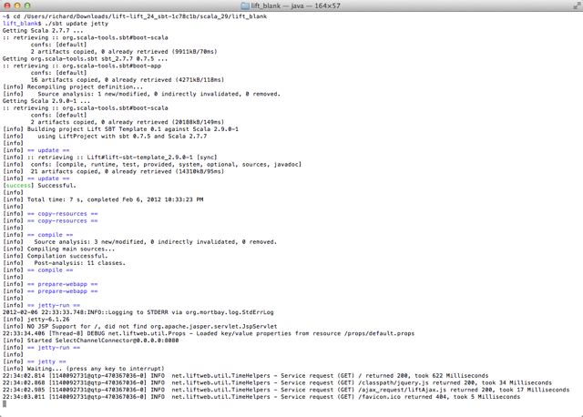

Downloading and running Lift 
=============================

Problem
-------

You want to install and run Lift on your computer.

ACTUALLY, THIS IS EXAMPLE MEANS USING SBT 0.7. 
WE SHOULD FORK THE MOST BASIC EXAMPLE AND US SBT 0.11.2

Solution
---------

### for Mac and Linux ###

* Visit [http://liftweb.net/getting_started](http://liftweb.net/getting_started)
* Download the latest release in ZIP format.
* Unzip the file.
* Start Terminal or your favoute shell tool.
* Naviate into the unzipped folder
* `cd scala_29/lift_blank` 
* `./sbt update jetty`
* Start your browser and go to `http://127.0.0.1:8080/`

### for Windows ###

* Visit [http://liftweb.net/getting_started](http://liftweb.net/getting_started)
* Download the latest release in ZIP format.
* Unzip the file.
* ?
* ?

### Expected result ###

The result of the above commands should be a basic Lift app running on your computer.

Discussion
----------

Lift isn't installed in the usual sense of "installing software".  Instead, it uses standard build tools, such as SBT or Maven, to assemble your application that makes use of the Lift framework. This recipe has downloaded a handful of bare-bones Lift applications, and then started one.

The `sbt` command starts the Simple Build Tool, a dependency management tool used by Scala projects.  The first command, `update`, causes SBT to fetch the libraries required by this lift_blank application.  The second command, `jetty`, starts the web server that listens on a port (8080 by default) and passes requests to the Lift application.

See also
--------

* [Simple Build Tool](https://github.com/harrah/xsbt/wiki)
* 

